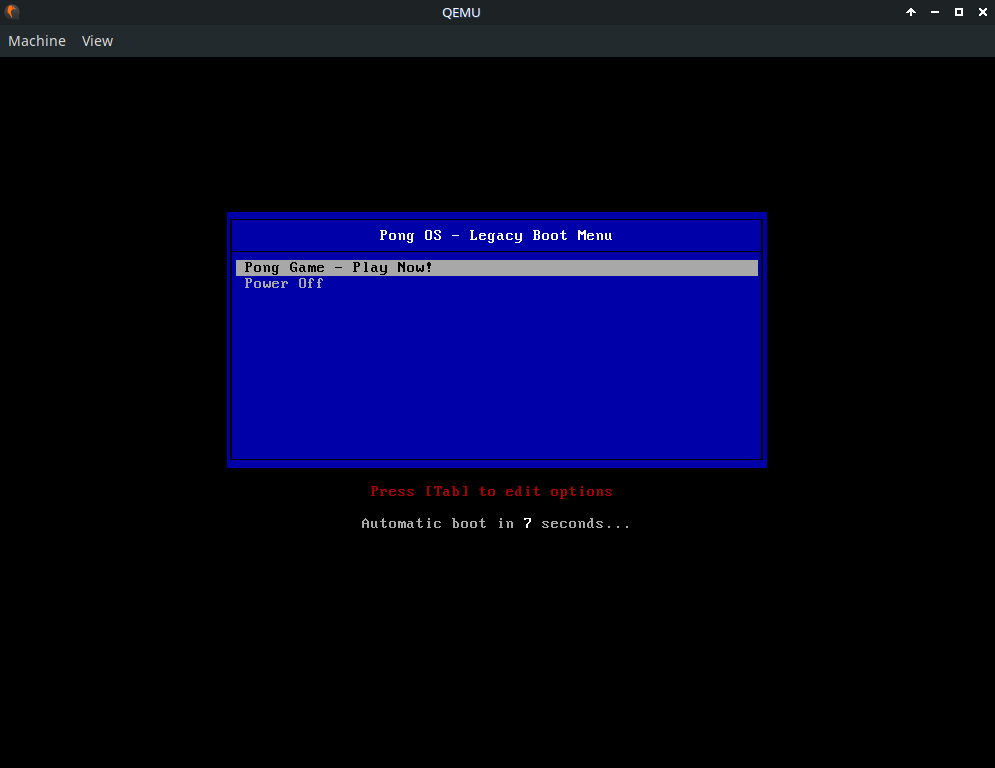
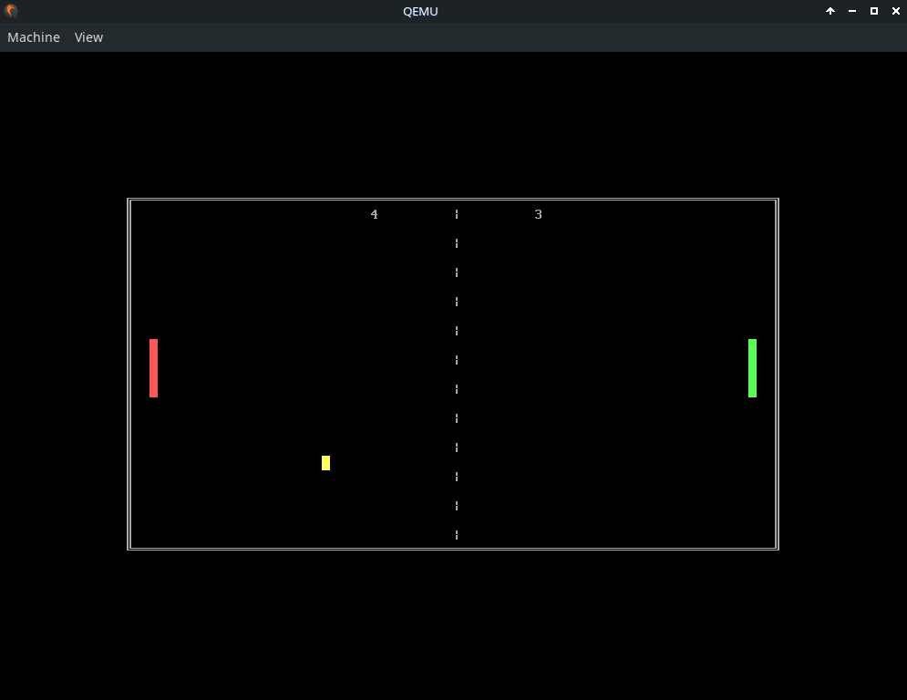

# Pong OS: A Bare-Metal x86 Project

Pong OS is a standalone 16-bit real-mode game that runs directly on x86 hardware without relying on any operating system. This project showcases low-level systems programming concepts, including custom bootloaders, BIOS interrupt usage, and direct VGA text-mode rendering.






## Technical Architecture

* **Bootloader**: A custom 512-byte MBR bootloader responsible for basic hardware setup, stack initialization, and loading the game kernel from disk.
* **Kernel**: A 16-bit assembly program that implements the Pong game logic, score handling, input processing, and VGA text-mode rendering.
* **Boot Protocol**: Supports both raw floppy disk images (`.img`) and optical media (`.iso`) using the ISOLINUX + MEMDISK framework.

## Toolchain Requirements

To build and run this project, ensure the following tools are available on your system:

* **NASM** — Netwide Assembler for assembling `.asm` source files.
* **QEMU** — x86 system emulator for testing.
* **Genisoimage / Mkisofs** — Used to generate ISO images.
* **Syslinux / ISOLINUX** — Provides the bootloader and `memdisk` module.
* **GNU Make** — Build automation tool.

### Installation (Debian / Ubuntu)

```bash
sudo apt update
sudo apt install nasm qemu-system-x86 genisoimage syslinux isolinux make
```

## Build Instructions

The project includes a Makefile to simplify common build and run tasks.

### Build All Targets (IMG & ISO)

```bash
make
```

### Run via ISO (ISOLINUX Menu)

```bash
make run-iso
```

### Run via Raw Image (Floppy Emulation)

```bash
make run-img
```

### Cleanup

```bash
make clean
```

## Project Structure

* `boot.asm` — First-stage bootloader (sector 1).
* `game.asm` — Main game kernel and gameplay logic.
* `isolinux.cfg` — ISOLINUX boot menu configuration.
* `Makefile` — Build rules and automation.

---

# Player Manual & Control Scheme

This document describes the control mapping and gameplay mechanics for Pong OS.

## Gameplay Controls

### Player 1 (Left Paddle — Red)

* **W** — Move paddle up
* **S** — Move paddle down

### Player 2 (Right Paddle — Green)

* **Arrow Up** — Move paddle up
* **Arrow Down** — Move paddle down

## System Commands

* **R** — Restart the match (available only on the Game Over screen)
* **ESC** — Perform a hard reboot and return to the ISOLINUX boot menu

## Rules of the Game

1. **Objective**: Prevent the ball from passing your goal line by deflecting it with your paddle.
2. **Scoring**: A point is awarded when the opponent fails to return the ball.
3. **Winning Condition**: The first player to reach a score of **9** wins the match.
4. **Boundaries**: The ball reflects off the top and bottom screen borders.

## Technical Note

Pong OS uses the standard BIOS keyboard buffer for input handling. When multiple keys are pressed simultaneously, hardware or emulator-specific keyboard ghosting may o
